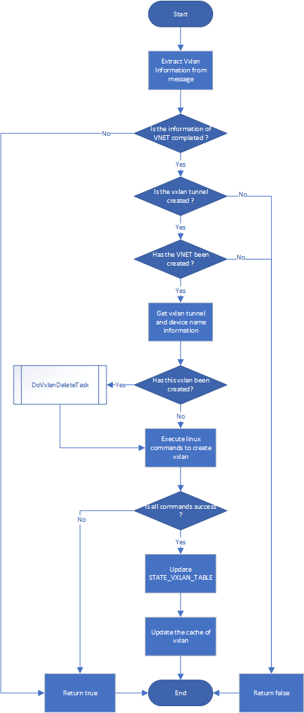

# Vxlan SONiC
# Vxlanmgrd design

###### Revision
| Rev |     Date    |       Author       | Change Description                |
|:---:|:-----------:|:------------------:|-----------------------------------|
| 0.1 | 04/14/2019  |     Ze Gan         | Initial version                   |

## Table of Contents
* [1: Description](#1:\ Description)
* [2: Architecture](#2:\ Architecture)
* [3: Modules and Flowchart](#3:\ Modules\ and\ Flowchart)
    * [3.1 Task selector](#3.1:\ Task\ selector)
    * [3.2 Vxlan create task](#3.2:\ Vxlan\ create\ Task)
    * [3.3 Vxlan tunnel create task](#3.3:\ Vxlan\ tunnel\ create\ Task)
    * [3.4 Vxlan tunnel map create task](#3.4:\ Vxlan\ tunnel\ map\ create\ Task)
    * [3.5 Vxlan delete task](#3.5:\ Vxlan\ delete\ Task)
    * [3.6 Vxlan tunnel delete task](#3.6:\ Vxlan\ tunnel\ delete\ Task)
    * [3.7 Vxlan tunnel map delete task](#3.7:\ Vxlan\ tunnel\ map\ delete\ Task)
* [4: Referenced Table](#4:\ Referenced\ Table)
    * [4.1 Input Tables](#4.1\ Input\ Tables)
        * [4.1.1 CFG_VXLAN_TUNNEL_TABLE](#4.1.1\ CFG_VXLAN_TUNNEL_TABLE)
        * [4.1.2 CFG_VXLAN_TUNNEL_MAP_TABLE](#4.1.2\ CFG_VXLAN_TUNNEL_MAP_TABLE)
        * [4.1.3 CFG_VNET_TABLE](#4.1.3\ CFG_VNET_TABLE)
        * [4.1.4 STATE_VRF_TABLE](#4.1.4\ STATE_VRF_TABLE)
    * [4.2 Output Tables](#4.2\ Output\ Tables)
        * [4.2.1 APP_VXLAN_TUNNEL_TABLE](#4.2.1\ APP_VXLAN_TUNNEL_TABLE)
        * [4.2.2 APP_VXLAN_TUNNEL_MAP_TABLE](#4.2.2\ APP_VXLAN_TUNNEL_MAP_TABLE)
        * [4.2.3 STATE_VXLAN_TABLE](#4.2.3\ STATE_VXLAN_TABLE)
* [5: Referenced linux commands](#5:\ Referenced\ linux\ commands)
    * [device naming rules](#device\ naming\ rules)
    * [Create Vxlan commands](#5.1\ create\ vxlan\ commands)
    * [Delete Vxlan commands](#5.2\ delete\ vxlan\ commands)


## 1: Description
The responsibility of Vxlanmgrd is to create vxlan devices in kernel.

## 2: Architecture


## 3: Modules and Flowchart
### 3.1 Task selector
According to the framework of swss to listen the change events of config database and to do the corresponding tasks.

### 3.2 Vxlan create task

### 3.3 Vxlan tunnel create task

### 3.4 Vxlan tunnel map create task

### 3.5 Vxlan delete task

### 3.6 Vxlan tunnel delete task

### 3.7 Vxlan tunnel map delete task


## 4. Referenced Tables
### 4.1 Input Tables
#### 4.1.1 CFG_VXLAN_TUNNEL_TABLE
```
VXLAN_TUNNEL|{{tunnel_name}} 
    "src_ip": {{ip_address}} 
    "dst_ip": {{ip_address}} (OPTIONAL)
```
#### 4.1.2 CFG_VXLAN_TUNNEL_MAP_TABLE
```
VXLAN_TUNNEL_MAP|{{tunnel_name}}|{{tunnel_map}}
    "vni": {{ vni_id}}
    "vlan": {{ vlan_id }}
```
#### 4.1.3 CFG_VNET_TABLE
```
VNET|{{vnet_name}} 
    "vxlan_tunnel": {{tunnel_name}}
    "vni": {{vni}} 
    "peer_list": {{vnet_name_list}} (OPTIONAL)
```
#### 4.1.4 STATE_VRF_TABLE
```
VRF_TABLE|{{vnet_name}}
    "state":"ok"
```
### 4.2 Output Tables
#### 4.2.1 APP_VXLAN_TUNNEL_TABLE
```
VXLAN_TUNNEL_TABLE|{{tunnel_name}} 
    "src_ip": {{ip_address}} 
    "dst_ip": {{ip_address}}
```
#### 4.2.2 APP_VXLAN_TUNNEL_MAP_TABLE
```
VXLAN_TUNNEL_MAP_TABLE|{{tunnel_name}}:{{tunnel_map}}
    "vni": {{ vni_id}}
    "vlan": {{ vlan_id }}
```
#### 4.2.3 STATE_VXLAN_TABLE
```
VXLAN_TABLE|{{vxlan_name}}
    "state":"ok"
```

## 5. Referenced linux commands
##### Device naming rules
| Device                   | Name                           |
|--------------------------|--------------------------------|
| VXLAN                    | {{VXLAN_TUNNEL}}{{VNI}}        |
| Bridge of VXLAN          | brvxlan{{VXLAN}}               |
### 5.1 Create vxlan commands
```
// Create vxlan device in linux kernel
ip link add {{VXLAN}} type vxlan id {{VNI}} local {{SOURCE_IP}} dstport 4789
// Activate the vxlan device
ip link set dev {{VXLAN}} up
// Create bridge device for vxlan in linux kernel
ip link add {{BRIDGE}} type bridge
// Add vxlan device into its bridge
brctl addif {{BRIDGE}} {{VXLAN}}
// Attach bridge to vnet
ip link set dev {{BRIDGE}} master {{VNET}}
// Activate the bridge of vxlan
ip link set dev {{BRIDGE}} up
```
### 5.2 Delete vxlan commands
```
// Detach bridge from vnet
ip link set dev {{BRIDGE}} nomaster
// Remove vxlan from bridge
brctl delif {{BRIDGE}} {{VXLAN}}
// Delete bridge device
ip link del {{BRIDGE}}
// Delete vxlan device
ip link del dev {{VXLAN}}
```